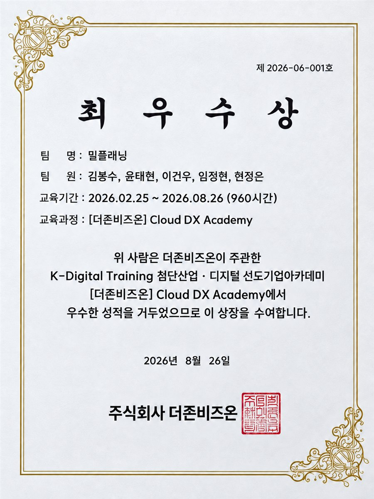
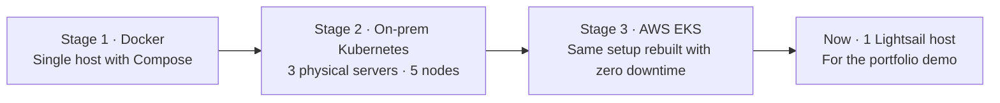
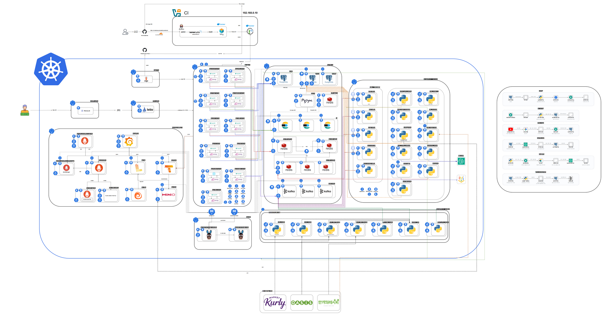
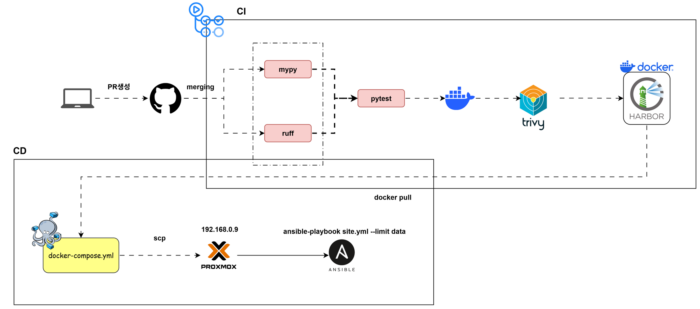
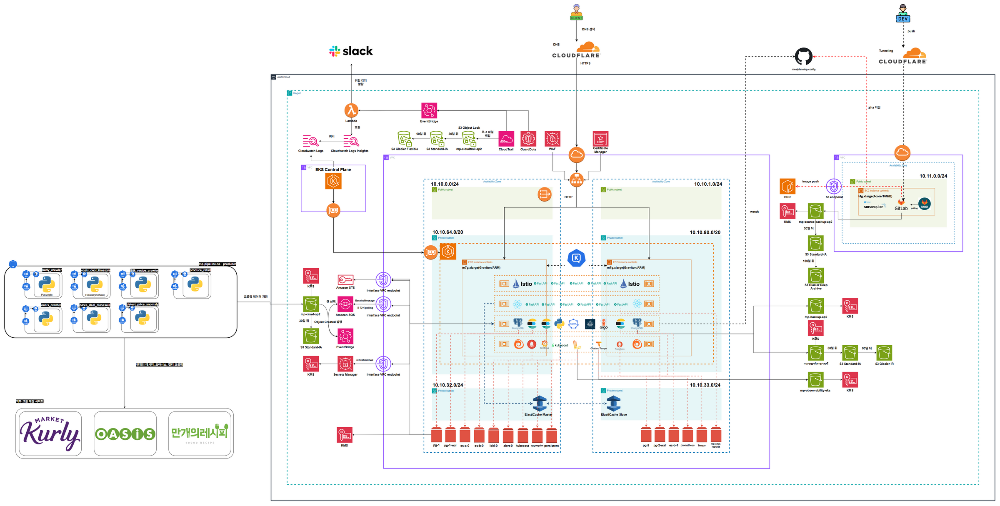

# MealPlanning

> **Fork notice**: this repository is a fork of [happyInit/food-budget-app](https://github.com/happyInit/food-budget-app), the Bravo-Team final project. The original authors keep all credit for the code and documents (see [Team](#team)). I'm Taehyun Yoon, one of the five team members, and this copy is for my portfolio. This README is an English translation of the original, plus a getting-started guide.

You enter a monthly food budget, and MealPlanning plans a month of meals for you. It then matches the recipe ingredients to current prices at Market Kurly and Oasis Market, so your grocery shopping is planned within the budget too.

**Bravo-Team** · Final project of the Douzone Cloud DX Academy, cohort 6 (2026-06-29 – 08-26, 5 members) · **Douzone Bizon First Prize (Grand Award)**

| | |
|---|---|
| Live demo | https://app.mealbong.cloud. Use the **"Try it out"** button on the first screen to explore without signing up |
| Demo videos | [Service feature demo](https://youtu.be/15qed6VQOZs) · [Zero-downtime Blue-Green switch under load](https://youtu.be/jHFDyPO0g60) |
| Infrastructure portfolio | https://bongsu.cloud. Details on the on-prem Kubernetes build and the AWS EKS migration |
| Final deliverables | [Plan · integrated specification · specs · paper · screens](docs/deliverables/) · [Presentation slides · original demo videos (Release)](https://github.com/happyInit/food-budget-app/releases/tag/final-deliverables) |

<p align="center"></p>

> **Summary**: a meal-planning service that turns a monthly food budget into a month of meals and matches recipe ingredients to live prices from Korean grocers (Kurly, Oasis Market). A team of five built it as the final project of the Douzone Cloud DX Academy, and it won First Prize. The app is 13 Python/React services. The infrastructure moved from Docker Compose to a 5-node on-prem Kubernetes cluster and then to AWS EKS. After the project ended, it was scaled down to a single Lightsail host for the live demo, cutting the monthly cost from $690 to $24.

---

## Key features

| Feature | Description |
|---|---|
| Budget-based meal plans | Plans a month of meals within your monthly food budget and tracks spending |
| Recipe search and recommendations | Serves 10,051 recipes from 10000recipe (Mangae Recipe) with Korean morphological search (Elasticsearch nori) and personalized ranking (LightGBM) |
| Ingredients → current prices | Extracts ingredients from recipe text (CRF NER), maps them to standard items, and matches them against 315,341 retail price records |
| Fridge | Tracks inventory and shelf life, and re-estimates shelf life when you change the storage zone (XGBoost) |
| Receipt OCR | Photograph a receipt and it updates your fridge inventory and food-spending records |
| YouTube recipes | Extracts a recipe from a video URL (Gemini multimodal) |
| Notifications | Low-price alerts (price anomaly detection) and alerts for items near expiry |
| Meal-plan assistant | A conversational assistant (RAG) that knows your inventory and budget |
| Recipe book | A personal collection of your favorite recipes |

All AI models are CPU-class so they run without a training GPU (GTX 1060 3GB). Only video understanding uses an external API.

## Architecture: infrastructure moved in three stages



**Stage 2: on-prem Kubernetes**



- kubeadm with 5 nodes (1 control plane, 4 workers) and 180 pods. Cilium replaces kube-proxy (eBPF), WireGuard encrypts traffic between nodes, plus Istio + Gateway API and MetalLB L2
- The data tier, which ran on 4 separate VMs, was moved into the cluster with operators: CloudNativePG, ECK, Strimzi (Kafka RF=3), and Redis Sentinel. Zero data loss at cutover
- Bidirectional default-deny NetworkPolicy, Istio mTLS STRICT, External Secrets to remove plaintext secrets, etcd encryption at rest, and CIS hardening
- PostgreSQL backed up to S3 with barman-cloud (RPO 5 min · RTO 10 min)

**CI/CD: GitOps**



- Jenkins runs tests, SonarQube, the image build, and a Trivy scan, then pushes to Harbor. It commits the image tag (commit hash) to the manifest repo, and ArgoCD applies it to the cluster
- Terraform (5 stacks, 216 resources) and Ansible (52 roles) codify everything from base node setup to the CI host

**Stage 3: AWS EKS migration**



- The running on-prem setup stayed untouched. Only the AWS configuration was added (separate Kustomize overlays), and both ran in parallel
- EKS with 2 m7g.xlarge (Graviton) nodes across 2 availability zones, ALB + ACM + WAF, ElastiCache for Valkey, S3, EBS gp3 CSI, and Karpenter
- CI moved to GitLab CE and authenticates with OIDC instead of long-lived access keys. Workloads use IRSA
- Migration integrity was checked with full checksum comparison of 41 PostgreSQL tables

### Measured results (2026-08)

| Item | Result |
|---|---|
| Load test (k6, EKS) | 1,346 req/s · p95 655 ms · p99 1.26 s · 12 failures out of 979,220 requests (0.0012%) |
| Node autoscaling | Karpenter scaled from 2 to 8 nodes, 51 s from request to running pod |
| HPA tuning | Recomputing the parameters brought p95 from 2.7 s to 46 ms |
| Cache stampede fix | Price lookup failures fell from 1,783 to 2 |
| Blue-Green switch | Argo Rollouts promotion in 1.80 s, zero 5xx across 1,409 requests during the switch |
| Forced control-plane shutdown | Zero ingress outages during 3 min 3 s without the apiserver |

## Current status (2026-09)

After the project ended, the AWS infrastructure (4 Terraform stacks, 279 resources) was torn down on 2026-09-02, and the demo service moved to **a single Lightsail host**.

- One Docker Compose stack with 15 containers (10 backend services, frontend, PostgreSQL, Elasticsearch, Redis, and Cloudflare Tunnel)
- Traffic comes in through Cloudflare Tunnel, with zero inbound ports
- PostgreSQL is dumped to S3 daily, and each dump is actually restored to confirm it matches production
- Monthly cost dropped from about **$690 to $24**

So the Kubernetes, EKS, Jenkins, and GitLab files in this repo, and the migration documents in `docs/`, are **records of what was built at the time**. The current deployment is [`deploy/portfolio/`](deploy/portfolio/).

## Tech stack

| Area | Technology |
|---|---|
| Frontend | React · Vite · TypeScript · PWA · TanStack Query · Zustand · Tailwind |
| Backend | Python · FastAPI · psycopg3 (raw SQL) · Pydantic · PyJWT |
| AI / ML | CRF (ingredient NER) · XGBoost (shelf life) · LightGBM (recipe ranking) · statistical anomaly detection · RAG · Gemini |
| Data | PostgreSQL · Elasticsearch (nori) · Redis · Kafka (Strimzi) |
| Container · Orchestration | Docker · Kubernetes (kubeadm · EKS) · Helm · Kustomize · Cilium · Istio · Gateway API · MetalLB |
| Scaling | HPA · KEDA · Karpenter |
| CI/CD | Jenkins · GitLab CI · GitHub Actions · ArgoCD · Argo Rollouts · Harbor · SonarQube · Trivy |
| IaC | Terraform · Ansible |
| AWS | EKS · EC2 · VPC · ALB · ACM · WAF · S3 · ElastiCache · ECR · IAM (OIDC · IRSA) · Secrets Manager · Lambda · SQS · Lightsail |
| Observability | Prometheus · Grafana · Loki · Tempo · Alertmanager · k6 |

## Repository structure

| Path | Contents |
|---|---|
| [`services/`](services/) | FastAPI backends: account · recipe · price · mealplan · pantry · recipebook · chat · notify · ocr · video · operations ([code conventions](services/CONVENTIONS.md)) |
| [`frontend/`](frontend/) | React + Vite PWA |
| [`ml/`](ml/) | Ingredient NER · recipe ranking · video recipe · chat insights models |
| [`crawler/`](crawler/) · [`pipelines/`](pipelines/) | Collection from 10000recipe, Market Kurly, and Oasis Market, plus the ingestion pipelines (the data is now a fixed snapshot, and these aren't run) |
| [`serverless/`](serverless/) | Serverless AI functions (not running since the AWS teardown) |
| [`infra/`](infra/) | Terraform · Ansible · certificates · diagnostic scripts. Current: [`infra/terraform/mp-portfolio/`](infra/terraform/mp-portfolio/) |
| [`deploy/`](deploy/) | Deployment configs. Current: [`deploy/portfolio/`](deploy/portfolio/) |
| [`loadtest/`](loadtest/) | k6 load-test scenarios |
| [`docs/`](docs/) | Canonical design docs and migration records (below) |

## Documentation

Most documents under `docs/` are written in Korean.

| Document | Contents |
|---|---|
| [`docs/design.md`](docs/design.md) | Canonical design |
| [`docs/prd/`](docs/prd/) | Canonical requirements and schemas |
| [`CONTEXT.md`](CONTEXT.md) | Domain glossary (standard items · gazetteer · shelf life …) |
| [`docs/adr/`](docs/adr/) | Architecture decision records |
| [`docs/mp_k8s_infra_migration_plan.md`](docs/mp_k8s_infra_migration_plan.md) | Kubernetes migration plan and rationale |
| [`docs/mp_aws_migration_plan.md`](docs/mp_aws_migration_plan.md) · [`docs/mp_aws_prep_checklist.md`](docs/mp_aws_prep_checklist.md) | AWS migration plan and final decisions |
| [`docs/mp_k6_aws_stage1_results.md`](docs/mp_k6_aws_stage1_results.md) | Load-test results |
| [`docs/backup-strategy.md`](docs/backup-strategy.md) | Backup strategy |
| [`docs/deliverables/`](docs/deliverables/) | Final deliverables: plan · integrated specification · API and data specs · paper |

## Getting started

### Backend services

| Service | Port | Notes |
|---|---|---|
| `recipe` | 8001 | Recipe search (Elasticsearch nori); built from the repo root |
| `price` | 8002 | Retail price lookup; Redis cache |
| `chat` | 8003 | Meal-plan assistant (RAG); needs ES + Redis |
| `account` | 8004 | Users, JWT issuing, Kakao/Google OAuth |
| `pantry` | 8005 | Fridge inventory and shelf life |
| `recipebook` | 8006 | Personal recipe collections |
| `mealplan` | 8007 | Budget-based meal planning and expenses |
| `notify` | 8008 | Low-price and expiry notifications |
| `ocr` | 8010 | Receipt OCR (Google Vision / Vertex) |
| `video` | 8011 | YouTube recipe extraction (Gemini) |
| `operations` | 8011 | Ops dashboard backend (not part of the portfolio stack) |

Ports come from each `services/*/Dockerfile`. Every service exposes `/health`. Code conventions are in [`services/CONVENTIONS.md`](services/CONVENTIONS.md).

### Prerequisites

- Docker with Docker Compose v2 (portfolio stack).
- For local development: Python 3 with `venv`, Node.js + npm, and a reachable PostgreSQL (and Elasticsearch for `recipe`/`chat`).
- Optional: AWS CLI with access to the seed bucket (`bootstrap.sh`), Google Cloud service-account credentials (OCR/video), Gemini API keys, Kakao/Google OAuth apps, and a Cloudflare Tunnel credential file.

### Run the current deployment (single-host Docker Compose)

```bash
cd deploy/portfolio
cp .env.example .env && chmod 600 .env   # fill in PGPASSWORD and JWT_SECRET (required)
sudo docker compose up -d --build        # first full build takes ~30–40 min on 2 vCPU
./bootstrap.sh                           # first run only: restore PostgreSQL + build ES index (pulls seed data from S3)
./smoke.sh                               # smoke test against http://localhost:8080
```

The stack runs PostgreSQL 16, Elasticsearch (nori image from `infra/images/elasticsearch-nori`), Redis 7, ten app services, the nginx frontend (bound to `127.0.0.1:8080`), and `cloudflared`. For the tunnel, put the credentials file at `deploy/portfolio/cloudflared/credentials.json` (routing is in `cloudflared/config.yml`). The host itself is provisioned by [`infra/terraform/mp-portfolio/`](infra/terraform/mp-portfolio/).

> The seed dump lives in a private S3 bucket, so `bootstrap.sh` can't reproduce the data without that access. Without it the services start against an empty database.

### Local development (all services + Vite)

```bash
./dev-db.sh up        # create an isolated dev DB on the team data host and apply docs/prd/*.sql
./dev-up.sh           # start backends with uvicorn (per-service .venv) + the Vite frontend
./dev-up.sh status    # health-check every service
./dev-up.sh logs <svc>
./dev-up.sh down
```

`dev-up.sh` injects `PGHOST`, `PGPORT`, `PGDATABASE`, `PGUSER`, `PGPASSWORD` (read from the root `.env` if not exported), `JWT_SECRET` (generated once into the gitignored `.env.dev-jwt`), `JWT_ALG`, `ESHOST`, and `ESPORT`. Its defaults and `dev-db.sh` both point at the team's on-prem data host (`192.168.0.8`), so override `PGHOST`/`ESHOST` (and create the schema from `docs/prd/schema-public-data.sql` then `docs/prd/schema-production.sql`) when running anywhere else. The frontend dev server proxies `/api/*` to each service (see `frontend/vite.config.ts`). Open http://localhost:5173.

### Configuration

Main variables for the portfolio stack (`deploy/portfolio/.env.example`):

| Variable | Required | Purpose |
|---|---|---|
| `PGPASSWORD` | yes | App DB password, also used to initialize the postgres container |
| `JWT_SECRET` | yes | Shared signing secret. Every service must use the same value |
| `PGDATABASE`, `PGUSER`, `JWT_ALG`, `LOG_LEVEL` | no | Defaults: `foodbudget`, `fbapp`, `HS256`, `INFO` |
| `PUBLIC_BASE_URL` | no | OAuth redirect base |
| `ES_INDEX`, `ES_USER_INDEX` | no | ES aliases (`recipes_live`, `user_recipes_live`) |
| `KAKAO_CLIENT_ID/SECRET`, `GOOGLE_CLIENT_ID/SECRET` | no | Social login |
| `GENERATOR_BACKEND`, `CHAT_GEMINI_API_KEY`, `GEMINI_MODEL`, `MONTHLY_CAP_ENABLED`, `MONTHLY_BUDGET_WON` | no | Chat assistant (`template` = free rule-based default; `gemini` = paid LLM with a monthly cap) |
| `GCP_SA_FILE`, `GCP_PROJECT_ID`, `GCP_LOCATION`, `OCR_BACKEND`, `GENAI_BACKEND`, `OCR_GEMINI_*`, `VIDEO_*` | no | OCR and video extraction. If left empty, only those features fail |

The root `.env.example` covers the data pipeline (`DATA_GO_KR_SERVICE_KEY`, `IMAGE_TAG`, optional `PG*`/`ES*`), and several services have their own `services/<svc>/.env.example`.

### Data pipeline (historical)

The root `docker-compose.yml` runs the Kafka consumers, pruners, and on-demand crawlers/pollers (`--profile tools` / `--profile poller`) on the `mp-data-pipeline` image built from the root `Dockerfile`. It's image-only. To build locally, run `docker compose -f docker-compose.yml -f docker-compose.build.yml build`. It expects external Kafka/PostgreSQL/Redis endpoints from `.env`, and the original data host no longer exists.

### Tests

```bash
# backend services that ship a pytest.ini (account, chat, mealplan, notify, operations, pantry, recipebook)
cd services/account && python3 -m venv .venv && .venv/bin/pip install -r requirements.txt pytest httpx
.venv/bin/python -m pytest -q

# frontend
cd frontend && npm install && npm test   # vitest; also: npm run build, npm run lint
```

Load-test scenarios (k6) are in [`loadtest/`](loadtest/).

### Notes

- Kubernetes, EKS, Jenkins, and GitLab files are a record of earlier stages. The live K8s manifests were kept in a separate config repo, and `deploy/k8s/` holds proposals only.
- Some scripts and configs reference private infrastructure (Harbor `192.168.0.10`, on-prem hosts `192.168.0.x`, private S3 buckets) that isn't reachable from outside the original lab.
- The seed data (PostgreSQL dump) is in a private S3 bucket, so this repo alone can't reproduce the same data.
- Collected recipe and price data was used only for non-commercial educational purposes.

## Team

| Name | Role |
|---|---|
| Bongsu Kim | Infrastructure lead: cluster design, build, and operations, AWS migration, IaC, CI/CD, security, load testing · backend · frontend |
| Taehyun Yoon | Backend · database · infrastructure |
| Geonwoo Lee | AI / ML |
| Jeongeun Hyun | Data collection pipeline |
| Jeonghyun Lim | Monitoring |
