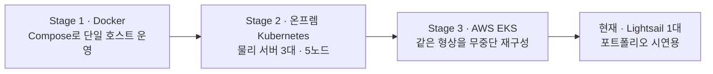

# 밀플래닝 · MealPlanning

월 식비 예산을 넣으면 한 달 식단을 짜 주고, 레시피 재료를 마켓컬리·오아시스마켓의 현재 가격과 맞춰 예산 안에서 장보기까지 계획해 주는 서비스입니다.

**Bravo-Team** · 더존 클라우드 DX Academy 6기 최종 프로젝트 (2026.06.29 – 08.26, 5명) · **더존비즈온 최우수상**

| | |
|---|---|
| 라이브 데모 | https://app.mealbong.cloud — 첫 화면의 **「체험해보기」** 로 가입 없이 둘러볼 수 있습니다 |
| 시연 영상 | [서비스 기능 시연](https://youtu.be/15qed6VQOZs) · [부하를 건 채 무중단 Blue-Green 전환](https://youtu.be/jHFDyPO0g60) |
| 인프라 포트폴리오 | https://bongsu.cloud — 온프렘 Kubernetes 구축과 AWS EKS 이관 상세 |
| 최종 산출물 | [계획서 · 시방서 · 명세서 · 논문 · 화면](docs/deliverables/) · [발표 자료 · 시연 영상 원본 (Release)](https://github.com/happyInit/food-budget-app/releases/tag/final-deliverables) |

<p align="center"></p>

> **English summary** — A meal-planning service that turns a monthly food budget into a month of meals, matching recipe ingredients against live prices from Korean grocers (Kurly, Oasis Market). Built by a team of five as the final project of the Douzone Cloud DX Academy (First Prize). The app is 13 Python/React services; the infrastructure went from Docker Compose to a 5-node on-prem Kubernetes cluster to AWS EKS, and after the project ended it was scaled down to a single Lightsail host for the live demo (monthly cost $690 → $24).

---

## 주요 기능

| 기능 | 내용 |
|---|---|
| 예산 기반 식단 | 월 식비 예산 안에서 한 달 식단을 계획하고 지출을 추적 |
| 레시피 검색·추천 | 만개의레시피 10,051개를 한국어 형태소 검색(Elasticsearch nori)과 개인화 랭킹(LightGBM)으로 제공 |
| 재료 → 현재가 | 레시피 문장에서 재료를 뽑고(CRF NER) 표준 품목으로 맞춘 뒤, 소매가 315,341건과 대조 |
| 냉장고 | 재고와 소비기한을 관리하고, 보관 구역을 바꾸면 소비기한을 다시 추정(XGBoost) |
| 영수증 OCR | 영수증을 찍으면 냉장고 재고와 식비 기록으로 반영 |
| YouTube 레시피 | 영상 URL에서 레시피를 추출(Gemini 멀티모달) |
| 알림 | 최저가(가격 이상 탐지)와 소비기한 임박 알림 |
| 식단 어시스턴트 | 재고·예산을 아는 대화형 어시스턴트(RAG) |
| 레시피북 | 마음에 드는 레시피를 모아 두는 개인 컬렉션 |

AI는 학습용 GPU 없이(GTX 1060 3GB) 돌도록 전부 CPU 계열 모델로 만들었습니다. 영상 이해만 외부 API를 씁니다.

## 아키텍처 — 세 단계로 옮긴 인프라



**Stage 2 — 온프렘 Kubernetes**


- kubeadm 5노드(control-plane 1 · worker 4), 파드 180개. Cilium이 kube-proxy를 대체(eBPF)하고 노드 간 통신은 WireGuard로 암호화, Istio + Gateway API, MetalLB L2
- 별도 VM 4대에서 돌던 데이터 계층을 오퍼레이터로 클러스터 안에 이전 — CloudNativePG · ECK · Strimzi(Kafka RF=3) · Redis Sentinel, 컷오버 데이터 유실 0
- 양방향 default-deny NetworkPolicy, Istio mTLS STRICT, External Secrets로 평문 시크릿 제거, etcd 저장 암호화, CIS 하드닝
- PostgreSQL을 barman-cloud로 S3에 백업(RPO 5분 · RTO 10분)

**CI/CD — GitOps**


- Jenkins가 테스트 · SonarQube · 이미지 빌드 · Trivy 스캔 후 Harbor에 올리고, 매니페스트 레포에 이미지 태그(커밋 해시)를 커밋 → ArgoCD가 클러스터에 반영
- Terraform 5개 스택 216개 리소스, Ansible 롤 52종으로 노드 기본 설정부터 CI 호스트까지 코드화

**Stage 3 — AWS EKS 이관**


- 운영 중인 온프렘은 건드리지 않고 AWS 형상만 추가(Kustomize 오버레이 분리)해 병행 가동
- EKS m7g.xlarge(Graviton) 2대 · 2개 가용영역, ALB + ACM + WAF, ElastiCache for Valkey, S3, EBS gp3 CSI, Karpenter
- CI는 GitLab CE로 옮기며 장기 액세스 키 대신 OIDC로 인증, 워크로드는 IRSA
- PostgreSQL 41개 테이블을 전체 체크섬으로 비교해 이관 정합성 판정

### 검증 수치 (2026-08 실측)

| 항목 | 결과 |
|---|---|
| 부하 시험 (k6, EKS) | 1,346 req/s · p95 655ms · p99 1.26초 · 979,220건 중 실패 12건(0.0012%) |
| 노드 자동 증설 | Karpenter 2대 → 8대, 요청부터 파드 실행까지 51초 |
| HPA 튜닝 | 파라미터 재산출로 p95 2.7초 → 46ms |
| 캐시 스탬피드 해소 | 가격 조회 실패 1,783건 → 2건 |
| Blue-Green 전환 | Argo Rollouts 승격 1.80초, 전환 중 1,409요청 5xx 0건 |
| control-plane 강제 종료 | apiserver 부재 3분 3초 동안 인그레스 중단 0건 |

## 현재 상태 (2026-09)

프로젝트가 끝난 뒤 2026-09-02에 AWS 인프라(Terraform 4개 스택 279개 리소스)를 철거하고, 시연용 서비스를 **Lightsail 1대**로 옮겼습니다.

- Docker Compose 한 벌, 컨테이너 15개(백엔드 10종 · 프론트엔드 · PostgreSQL · Elasticsearch · Redis · Cloudflare Tunnel)
- Cloudflare Tunnel로 진입 — 인바운드 포트 0
- 매일 PostgreSQL 덤프를 S3에 백업하고, 실제로 복원해 운영본과 일치하는지 확인
- 월 비용 약 **$690 → $24**

그래서 레포의 Kubernetes · EKS · Jenkins · GitLab 관련 파일과 `docs/`의 이관 문서는 **당시 구축 기록**입니다. 현행 배포는 [`deploy/portfolio/`](deploy/portfolio/)입니다.

## 기술 스택

| 영역 | 기술 |
|---|---|
| Frontend | React · Vite · TypeScript · PWA · TanStack Query · Zustand · Tailwind |
| Backend | Python · FastAPI · psycopg3(raw SQL) · Pydantic · PyJWT |
| AI / ML | CRF(재료 NER) · XGBoost(소비기한) · LightGBM(레시피 랭킹) · 통계 이상 탐지 · RAG · Gemini |
| Data | PostgreSQL · Elasticsearch(nori) · Redis · Kafka(Strimzi) |
| Container · Orchestration | Docker · Kubernetes(kubeadm · EKS) · Helm · Kustomize · Cilium · Istio · Gateway API · MetalLB |
| Scaling | HPA · KEDA · Karpenter |
| CI/CD | Jenkins · GitLab CI · GitHub Actions · ArgoCD · Argo Rollouts · Harbor · SonarQube · Trivy |
| IaC | Terraform · Ansible |
| AWS | EKS · EC2 · VPC · ALB · ACM · WAF · S3 · ElastiCache · ECR · IAM(OIDC · IRSA) · Secrets Manager · Lambda · SQS · Lightsail |
| Observability | Prometheus · Grafana · Loki · Tempo · Alertmanager · k6 |

## 레포 구조

| 경로 | 내용 |
|---|---|
| [`services/`](services/) | FastAPI 백엔드 — account · recipe · price · mealplan · pantry · recipebook · chat · notify · ocr · video · operations ([코드 컨벤션](services/CONVENTIONS.md)) |
| [`frontend/`](frontend/) | React + Vite PWA |
| [`ml/`](ml/) | 재료 NER · 레시피 랭킹 · 영상 레시피 · 챗 인사이트 모델 |
| [`crawler/`](crawler/) · [`pipelines/`](pipelines/) | 만개의레시피 · 마켓컬리 · 오아시스마켓 수집과 수집 파이프라인 (현재는 데이터 스냅샷 고정, 실행하지 않음) |
| [`serverless/`](serverless/) | AI 서버리스 함수 (AWS 철거로 현재 미가동) |
| [`infra/`](infra/) | Terraform · Ansible · 인증서 · 진단 스크립트 — 현행은 [`infra/terraform/mp-portfolio/`](infra/terraform/mp-portfolio/) |
| [`deploy/`](deploy/) | 배포 구성 — 현행은 [`deploy/portfolio/`](deploy/portfolio/) |
| [`loadtest/`](loadtest/) | k6 부하 시험 시나리오 |
| [`docs/`](docs/) | 설계 정본과 이관 기록 (아래) |

## 문서

| 문서 | 내용 |
|---|---|
| [`docs/design.md`](docs/design.md) | 설계 정본 |
| [`docs/prd/`](docs/prd/) | 요구사항 · 스키마 정본 |
| [`CONTEXT.md`](CONTEXT.md) | 도메인 용어집 (표준 품목 · Gazetteer · 소비기한 …) |
| [`docs/adr/`](docs/adr/) | 아키텍처 결정 기록 |
| [`docs/mp_k8s_infra_migration_plan.md`](docs/mp_k8s_infra_migration_plan.md) | Kubernetes 이관 계획과 결정 근거 |
| [`docs/mp_aws_migration_plan.md`](docs/mp_aws_migration_plan.md) · [`docs/mp_aws_prep_checklist.md`](docs/mp_aws_prep_checklist.md) | AWS 이관 계획과 확정 결정 |
| [`docs/mp_k6_aws_stage1_results.md`](docs/mp_k6_aws_stage1_results.md) | 부하 시험 결과 |
| [`docs/backup-strategy.md`](docs/backup-strategy.md) | 백업 전략 |
| [`docs/deliverables/`](docs/deliverables/) | 최종 산출물 — 계획서 · 통합 시방서 · API · 데이터 명세서 · 논문 |

## 실행

현행 배포는 [`deploy/portfolio/`](deploy/portfolio/)의 Docker Compose 스택입니다.

```bash
cd deploy/portfolio
cp .env.example .env && chmod 600 .env   # PGPASSWORD · JWT_SECRET 등 필수 값 입력
sudo docker compose up -d --build        # 전체 빌드는 2 vCPU 기준 30~40분
./bootstrap.sh                           # 최초 1회: PostgreSQL 복원 + Elasticsearch 색인
./smoke.sh                               # 스모크 검증
```

시드 데이터(PostgreSQL 덤프)는 비공개 S3에 있어 이 레포만으로는 같은 데이터를 재현할 수 없습니다. 수집 데이터는 교육용 비상업 목적으로만 사용했습니다.

## 팀

| 이름 | 담당 |
|---|---|
| 김봉수 | 인프라 리드 — 클러스터 설계·구축·운영, AWS 이관, IaC, CI/CD, 보안, 부하 시험 · 백엔드 · 프론트엔드 |
| 윤태현 | 백엔드 · 데이터베이스 · 인프라 |
| 이건우 | AI / ML |
| 현정은 | 데이터 수집 파이프라인 |
| 임정현 | 모니터링 |
