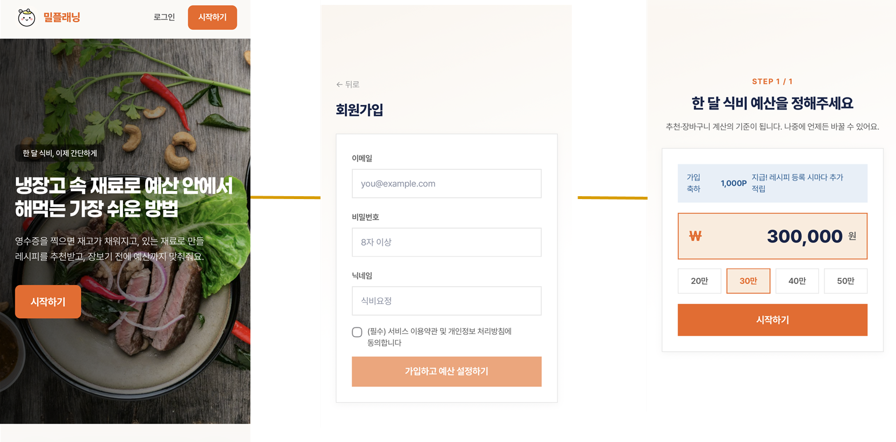
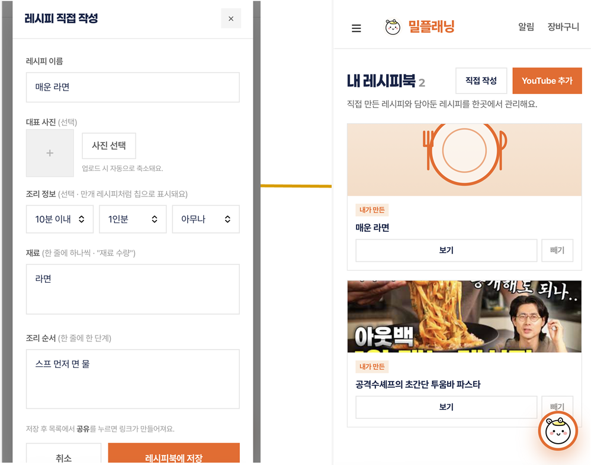
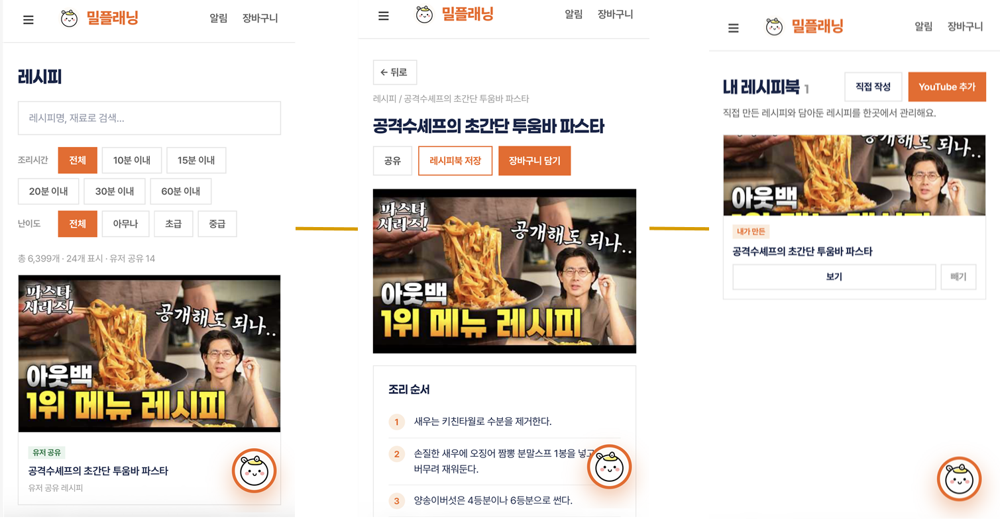
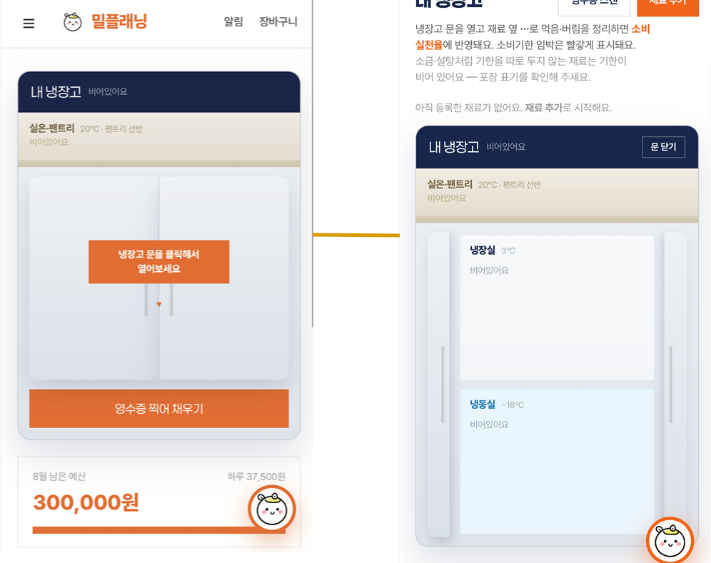
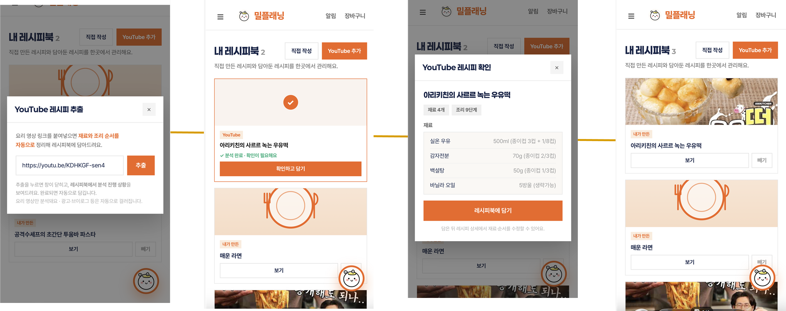
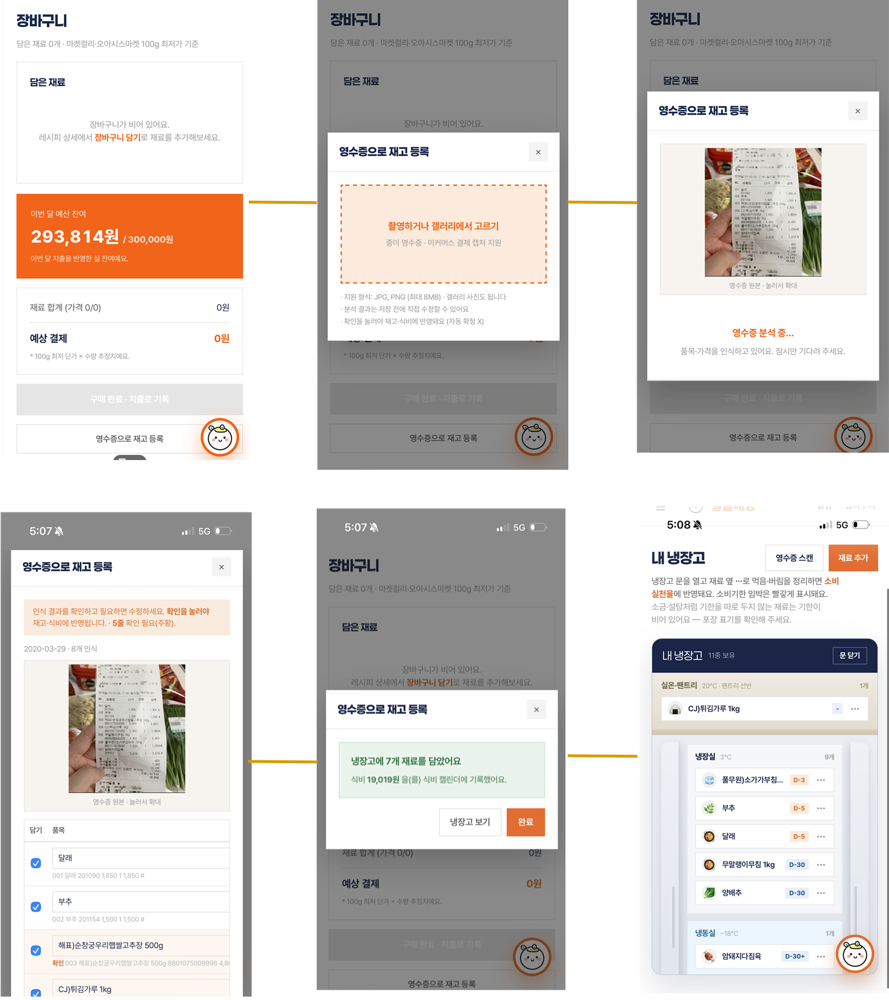

# 최종 산출물

더존 클라우드 DX Academy 6기 최종 프로젝트(2026.06.29 – 08.26)에 제출한 산출물입니다. GitHub에서 바로 볼 수 있도록 원본 옆에 PDF 변환본을 함께 두었습니다.

발표 자료 · 시연 영상 · AWS 설계도 원본은 용량이 커서 **[Release — 최종 산출물](https://github.com/happyInit/food-budget-app/releases/tag/final-deliverables)** 에 첨부했습니다.

## 문서

| 구분 | 문서 | 보기 | 원본 |
|---|---|---|---|
| 기획 | 프로젝트 계획서 | [PDF · 7쪽](01_기획/프로젝트계획서.pdf) | [docx](01_기획/프로젝트계획서.docx) |
| 기획 | WBS · 프로젝트 일정 | [PDF · 2쪽](01_기획/WBS_프로젝트일정.pdf) | [xlsx](01_기획/WBS_프로젝트일정.xlsx) |
| 기획 | 통합 인프라 시방서 (Docker → 온프렘 K8s → AWS EKS) | [PDF · 92쪽](01_기획/통합시방서_Docker-K8s-AWS.pdf) | [xlsx](01_기획/통합시방서_Docker-K8s-AWS.xlsx) |
| 기획 | AWS 비용 관리 | [PDF · 6쪽](01_기획/AWS_비용관리.pdf) | [xlsx](01_기획/AWS_비용관리.xlsx) |
| 데이터 | API 명세서 | [PDF · 3쪽](02_데이터/API명세서.pdf) | [xlsx](02_데이터/API명세서.xlsx) |
| 데이터 | 데이터 명세서 | [PDF · 57쪽](02_데이터/데이터명세서.pdf) | [xlsx](02_데이터/데이터명세서.xlsx) |
| 데이터 | 데이터 전처리 과정 | [PDF · 5쪽](02_데이터/데이터전처리과정.pdf) | [xlsx](02_데이터/데이터전처리과정.xlsx) |
| 데이터 | 정규화 과정 (1 · 2 · 3정규형) | — | [xlsx](02_데이터/정규화과정.xlsx) ¹ |
| 화면 | 프론트엔드 화면정의서 | [PDF · 5쪽](03_화면/프론트엔드_화면정의서.pdf) | [xlsx](03_화면/화면정의서.xlsx) |
| 논문 | 프로젝트 논문 (workbook) | [PDF · 136쪽](04_논문/프로젝트논문_workbook.pdf) | [docx](04_논문/프로젝트논문_workbook.docx) |

¹ 한셀로 작성한 파일이라 Excel에서는 열리지 않을 수 있습니다. 한셀 · 한컴오피스로 열어 주세요.

AWS 계정 ID와 공인 IP는 `<ACCOUNT_ID>` · `<EIP>` · `<ACADEMY_PG_IP>`로 가렸습니다.

## 화면

<table>
<tr>
<td> 회원가입</td>
<td> 레시피 추가</td>
</tr>
<tr>
<td> 공유 레시피 담기</td>
<td> 냉장고</td>
</tr>
<tr>
<td> YouTube 레시피 추출</td>
<td> 영수증 OCR → 냉장고</td>
</tr>
</table>

## Release 첨부 파일

| 파일 | 내용 | 크기 |
|---|---|---|
| [mealplanning-final-presentation.pdf](https://github.com/happyInit/food-budget-app/releases/download/final-deliverables/mealplanning-final-presentation.pdf) | 최종 발표 자료 (PDF) | 98 MB |
| [mealplanning-final-presentation.pptx](https://github.com/happyInit/food-budget-app/releases/download/final-deliverables/mealplanning-final-presentation.pptx) | 최종 발표 자료 원본 | 38 MB |
| [demo-zero-downtime-deploy-under-load.mp4](https://github.com/happyInit/food-budget-app/releases/download/final-deliverables/demo-zero-downtime-deploy-under-load.mp4) | 부하를 건 채 무중단 배포 시연 ([YouTube](https://youtu.be/jHFDyPO0g60)) | 103 MB |
| [demo-app-features.mp4](https://github.com/happyInit/food-budget-app/releases/download/final-deliverables/demo-app-features.mp4) | 애플리케이션 기능 시연 ([YouTube](https://youtu.be/15qed6VQOZs)) | 9 MB |
| [demo-anomaly-dashboard.mp4](https://github.com/happyInit/food-budget-app/releases/download/final-deliverables/demo-anomaly-dashboard.mp4) | 이상징후 대시보드 시연 | 8 MB |
| [aws-architecture.drawio](https://github.com/happyInit/food-budget-app/releases/download/final-deliverables/aws-architecture.drawio) | AWS 설계도 원본 ([draw.io](https://app.diagrams.net)에서 열기) | 35 MB |

## 싣지 않은 것

- **PostgreSQL 덤프** — 수집한 가격 · 레시피 데이터와 사용자 테이블이 들어 있어 공개하지 않습니다.
- **프로젝트 수행 결과보고서** — 참여자 명단에 팀원 개인 연락처가 들어 있어 싣지 않았습니다.
- **개발 코드 · Kubernetes 매니페스트 사본** — 제출 시점의 사본이라, 이 레포 본문을 정본으로 봐 주세요.
