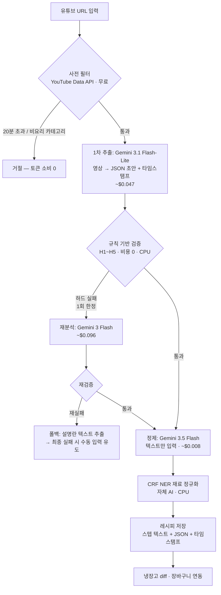

# PoC — 유튜브 영상 → 레시피 추출 AI 파이프라인 (#2 확장)

> **대상 독자:** PoC 검증 담당자
> **상태:** 파이프라인 구조·모델 선정 **확정** / 캐싱 정책 **확정 (C안, 2026-07-09)** — §6.1
> **결정일:** 2026-07-09 · 상세 배경: `design.md` §3.4(데이터 정책) · §4.4(추출 파이프라인)
> 요금 출처: [Gemini API 공식 요금표](https://ai.google.dev/gemini-api/docs/pricing) (2026-07 기준, 구현 시점 재확인 필요)

---

## 1. 결정 요약

유튜브 URL 입력 → 사람이 읽기 좋은 조리 스텝 + 구조화 데이터(JSON)를 추출한다.
Gemini 모델 3종을 **역할 분담**해 비용과 품질을 동시에 잡는다.

| 역할 | 모델 | 이유 |
|---|---|---|
| 1차 추출 (영상→JSON 초안) | **Gemini 3.1 Flash-Lite** | 영상 토큰이 비용의 90%+ — 가장 싼 모델로 통과 |
| 정제 (초안→깔끔한 문장) | **Gemini 3.5 Flash** | 텍스트만 입력이라 건당 $0.01 미만 — 품질 병목을 최고 모델로 해결 |
| 실패 시 재분석 (1회 한정) | **Gemini 3 Flash** | 하드 실패 시에만 영상 재분석 — 품질/비용 중간값 |

**핵심 원칙**

- 내부 정본은 **JSON** (재료/분량/스텝/타임스탬프). 유저 표시용 텍스트는 JSON에서 렌더링
- 각 조리 스텝에 **영상 타임스탬프** 포함 — UI 구간 점프용, 별도 활용 가능하도록 독립 필드로 저장
- 토큰 소비 전 **사전 필터** (YouTube Data API, 무료): 20분 초과·요리 무관 카테고리 사전 거절
- 마지막에 **자체 CRF NER**로 재료 정규화("대파 반 단"→표준 품목) — 냉장고 diff·장바구니 연동 접점

## 2. 파이프라인

**평균 단가: 건당 약 $0.063 (≈88원)** — 추출 $0.047 + 정제 $0.008 + 재분석 기대값(실패율 8% 가정) $0.008

## 3. 모델 비교 · 비용 (8~10분 영상 기준)

계산 전제: 영상 258토큰/초 + 오디오 32토큰/초 → 9분 영상 ≈ 입력 15.7만 토큰. 출력(스텝+씽킹) ≈ 2~3천 토큰.

| 모델 | 입력 단가 (1M, 영상/오디오) | 출력 단가 | 1건 비용 | **$10당 분석 개수** |
|---|---|---|---|---|
| 3.1 Flash-Lite | $0.25 / $0.50 | $1.50 | $0.042~0.052 | **190~240개** |
| 3 Flash | $0.50 / $1.00 | $3.00 | $0.086~0.107 | **94~115개** |
| 3.5 Flash | $1.50 (모달리티 무관) | $9.00 | $0.25~0.30 | **33~40개** |
| 3.1 Pro (배제) | $2.00 / $2.00 | $12.00 | $0.34~0.37 | 25~30개 |
| **확정 파이프라인 (혼합)** | — | — | **~$0.063** | **~160개** |

- 3.1 Pro 배제 사유: "듣고 정리하기" 작업에서 3.5 Flash 대비 우위 없음, 비용만 상승
- 무료 티어: 유튜브 입력 **하루 8시간 무료** (9분 영상 ~50개/일) → PoC 검증은 $0으로 가능. 단 무료 티어는 입력이 구글 학습에 사용됨 → 프로덕션은 유료 티어

## 4. 실패 감지 기준 (규칙 기반, 전부 CPU·비용 0)

### 하드 실패 → 3 Flash 재분석 트리거 (1회 한정)

| # | 기준 | 근거 |
|---|---|---|
| H1 | JSON 파싱 실패 / Pydantic 스키마 불일치 | 스택에 Pydantic 확정 — 검증 공짜 |
| H2 | 재료 0개 또는 스텝 2개 미만 | 레시피 성립 불가 |
| H3 | 요리명 null / 모델의 "요리 영상 아님" 판정 | 사전 필터 통과한 비요리 영상 잔존 |
| H4 | 타임스탬프 단조증가 위반 / 영상 길이 초과 | 환각 대표 신호 |
| H5 | 스텝 중복률 50% 초과 (동일 문장 반복) | 모델 루프 오류 패턴 |

### 소프트 실패 → 재분석 없이 플래그 (정제 단계 보정)

| # | 기준 | 처리 |
|---|---|---|
| S1 | 분량 결측률 > 50% | "적당량" 표기 후 통과. **30~50%는 정상 — 한식 특성("한줌", "적당량")은 실패 아님** |
| S2 | NER 사전 매칭 실패율 > 40% | 환각 의심 플래그 — 자체 재료 사전이 검증기 역할 |
| S3 | 설명란 교차 검증 (사전 필터 데이터 재활용) | 설명란 재료 목록과 겹침률 낮으면 플래그 |
| S4 | 비한국어 출력 | 실패 아님 → "외국 레시피, P1 로컬라이징(#10) 대상"으로 라우팅. MVP는 "지원 예정" 응답 |

최종 실패 처리: 재분석도 하드 실패 → 설명란 텍스트 추출 폴백 → 수동 입력 유도. **무한 재시도 금지.**

## 5. 월 비용 시뮬레이션

월 비용 = 요청 수 × (1 − 캐시 적중률) × $0.063

| 월 요청 수 | 캐싱 없음 | 적중 50% | 적중 70% | 적중 90% |
|---|---|---|---|---|
| 1,000건 | $63 | $32 | $19 | $6 |
| 2,000건 (유저 500명×월 4회) | $126 | $63 | $38 | $13 |
| 5,000건 | $315 | $158 | $95 | $32 |
| 10,000건 | $630 | $315 | $189 | $63 |

요리 유튜브는 인기 채널 집중도가 높아 교차 유저 적중률 60~80% 추정.
**캐싱 없으면 LLM 비용($126/월~)이 인프라 전체 예산($85~100/월)을 초과.**

## 6. 미결 사항 (PoC 담당자 주의 — 아직 결정 아님)

| 항목 | 내용 | 상태 |
|---|---|---|
| **캐싱 정책** | **확정 → C안 (TTL 30일 교차유저 캐시). 상세 §6.1.** A(영구 전면)는 법적 노출↑·무효화 부담, B(유저스코프)는 절감 미미로 배제 | ✅ 확정 (2026-07-09) |
| **media resolution low** | 영상 토큰 258→66/초 (비용 ~¼). 음성 의존 추출이라 가능성 높으나 화면 자막(재료 딱지) 인식 저하 우려 | 🟡 PoC에서 A/B 검증 |
| 유튜브 URL 입력 기능의 과금 정책 | 현재 위 토큰 단가 적용이나 preview 성격 — 변동 가능 | 구현 시점 재확인 |

### 6.1 캐싱 정책 — 확정: C안 (TTL 30일 교차유저 캐시) · 2026-07-09

- **저장소:** Redis (기존 스택). 키 = 정규화 canonical `video_id`, 값 = 추출 JSON. **TTL 30일 네이티브 만료** → 수동 무효화·스윕 잡 불필요.
- **개인화 분리:** 캐시 히트여도 각 유저 레시피북(PG)에는 **개별 복사**(편집·메모 보존). 공유 캐시는 **추출비 최적화 전용**이지 유저 데이터가 아님. 흐름: 제출 → 캐시 조회 → (히트) PG 복사 / (미스) Gemini → 캐시 저장 + PG 복사.
- **스탬피드 방지 (필수):** 바이럴 영상 동시 제출 시 캐시 미스 폭주 → `video_id`별 **단일비행 락**(Redis SETNX). 첫 요청만 Gemini 호출, 동시 요청은 대기/폴링. (§8.1 피크 스파이크 대응 겸 인프라 캡스톤 데모 소재)
- **URL 정규화 (필수):** `youtu.be/…` · `watch?v=…&t=` · 재생목록 파라미터 → canonical `video_id`. 미정규화 시 히트율 급락.
- **출처 표기:** 캐시·레시피북 항목에 원본 영상 링크 표기 (법적 완화).
- **배제안:** A(영구 전면) = 영구 교차유저 파생 DB → 법적 노출 최고 + 모델버전 무효화 부담, 증분 절감이 비용 정당화 못함. B(유저스코프) = 절감 미미 → 자기 레시피북 idempotency로만 흡수.
- **비용 효과:** 2000건/월 $126 → **~$44** (교차 히트율 65% 가정). *텍스트 우선·Gemini 폴백*(§2 폴백 반전안) 병행 시 추가 하락.
- **SSOT 정합:** `design.md §3.4`에 반영 완료 (한시 캐시 허용 · 영구 공유 저장소 불가 · 유저 레시피북 개인용). 파이프라인은 §4.4.
- **PoC 실측:** 교차유저 히트율(가정 60~70%) · 콜드스타트 영향 (§7).

## 7. PoC 검증 체크리스트

전부 **무료 티어로 수행 가능** (하루 유튜브 8시간).

- [ ] 요리 영상 20개 선정 (조건 분산: 발화 명확 /BGM만·자막 위주 /"적당량" 다용 /계량 정확)
- [ ] 확정 파이프라인(Flash-Lite→3.5 Flash) vs 3 Flash 단일 — 산출물 블라인드 품질 비교
- [ ] media resolution **default vs low** A/B (동일 20개) — 재료 누락률·스텝 정확도 비교
- [ ] 실패율 실측 → H1~H5 발동률이 가정치(8%)와 부합하는지 확인, 임계값 튜닝
- [ ] 타임스탬프 정확도 검증 (스텝별 ±10초 이내인지 수동 확인)
- [ ] NER 정규화 성공률 측정 (S2 임계값 40%의 타당성 확인)
- [ ] 건당 실제 과금액 기록 → §3 추정치와 대조
- [ ] **교차유저 캐시 히트율 실측** (§6.1 C안 전제 60~70% 검증 · 콜드스타트 영향 포함)

**산출물:** 위 결과를 본 문서에 추가 커밋 (§8 검증 결과 섹션 신설) + `design.md` §4.4 갱신
